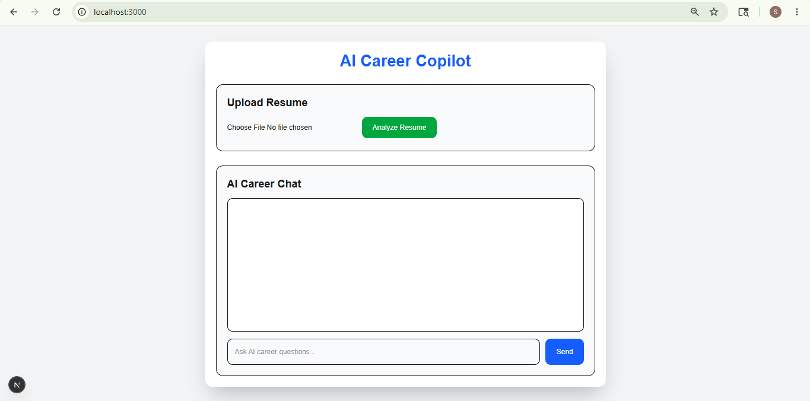

# 🚀 AI Career Copilot

An advanced multi-agent GenAI career assistant built using FastAPI, Next.js, LangGraph, and Groq LLM.

This AI system helps users:
- Analyze resumes
- Detect missing skills
- Generate interview questions
- Provide career roadmaps
- Offer personalized AI career guidance

---

# ✨ Features

## 🤖 Multi-Agent AI System
- Resume Agent
- Career Agent
- Interview Agent
- Skill Gap Agent
- Supervisor Agent

## 🧠 LangGraph Workflow
- Graph-based AI orchestration
- Dynamic agent routing
- Context-aware workflows

## 📄 Resume Analysis
- PDF resume upload
- Resume text extraction
- ATS suggestions
- Missing skills detection
- Personalized career feedback

## 💬 AI Career Chat
- AI-powered chatbot
- Personalized responses
- Resume-aware AI memory

---

# 🛠️ Tech Stack

## Frontend
- Next.js
- React
- Tailwind CSS

## Backend
- FastAPI
- Python

## AI / GenAI
- Groq LLM
- LangGraph
- Multi-Agent Architecture

## Other Libraries
- PyPDF
- LangChain Core

---

# 🧠 AI Architecture

Frontend (Next.js)
↓
FastAPI Backend
↓
LangGraph Workflow
↓
Supervisor Agent
↓
Specialized AI Agents
↓
Groq LLM

---

# 📸 Screenshots

## Home Page


## Resume Analysis


## AI Career Chat


## Multi-Agent Workflow


---

# 🚀 Installation

## Clone Repository

```bash
git clone https://github.com/sanketcodes-16/AI-Career-Copilot.git
```

---

## Frontend Setup

```bash
cd frontend
npm install
npm run dev
```

---

## Backend Setup

```bash
cd backend

python -m venv venv

venv\Scripts\activate

pip install -r requirements.txt

uvicorn main:app --reload
```

---

# 🔑 Environment Variables

Create `.env` inside backend folder:

```env
GROQ_API_KEY=your_api_key
```

---

# 📌 Future Improvements

- MongoDB memory
- Voice AI agent
- Authentication
- Streaming AI responses
- Cloud deployment
- Vector database memory

---

# 👨‍💻 Author

Sanket More

---